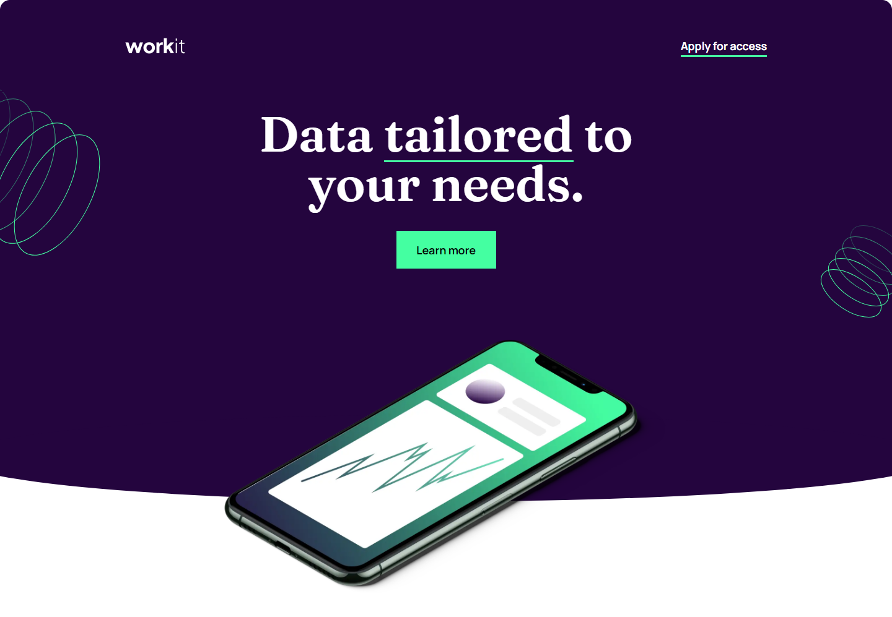

# Frontend Mentor - Workit landing page solution

This is a solution to the [Workit landing page challenge on Frontend Mentor](https://www.frontendmentor.io/challenges/workit-landing-page-2fYnyle5lu). Frontend Mentor challenges help you improve your coding skills by building realistic projects. 

## Table of contents

- [Overview](#overview)
  - [The challenge](#the-challenge)
  - [Screenshot](#screenshot)
  - [Links](#links)
- [My process](#my-process)
  - [Built with](#built-with)
  - [What I learned](#what-i-learned)
  - [Continued development](#continued-development)
- [Author](#author)

## Overview

### The challenge

Users should be able to:

- View the optimal layout for the interface depending on their device's screen size
- See hover and focus states for all interactive elements on the page

### Screenshot

### Links

- Solution URL: [GitHub Repo](https://github.com/ryanbradley-webdev/workit-landing-page)
- Live Site URL: [Hosted on Firebase](https://workit-d871f.web.app/)

## My process

### Built with

- [React](https://reactjs.org/) - JS library
- [Vite](https://vitejs.dev/) - Web bundler
- [Firebase](https://firebase.google.com/) - BaaS

### What I learned

This project proved to be deceptively challenging. I learned quite a bit about utilizing pseudo elements for sections to place additional content and flair. 

### Continued development

For future projects I'll be exploring more audacious and atypical designs to further refine my CSS skills. Additionally, my use of breakpoints for layout changes is improving, but still needs to be refined.

## Author

- Visit my portfolio - [ryanbradleyportfolio.com](https://ryanbradleyportfolio.com)
- Contact me for your next website - [ryanbradleywebdev.com](https://ryanbradleywebdev.com)
- Email me - [ryan@ryanbradleywebdev.com](ryan@ryanbradleywebdev.com)
- Follow my Instagram - [@ryanbradley_web_dev](https://www.instagram.com/ryanbradley_web_dev/)
